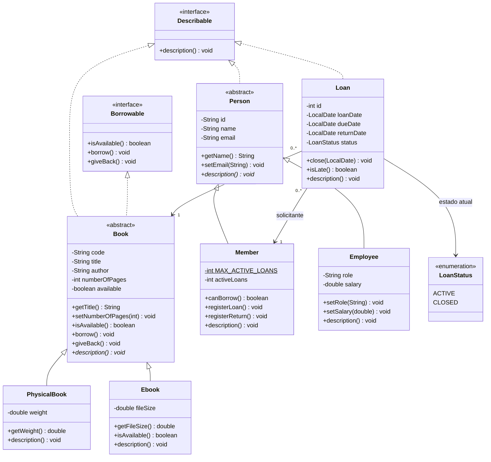
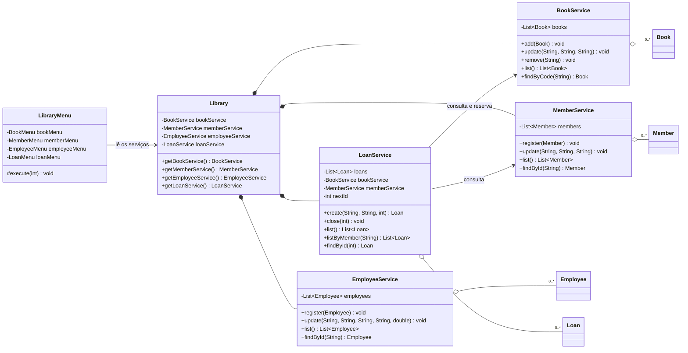
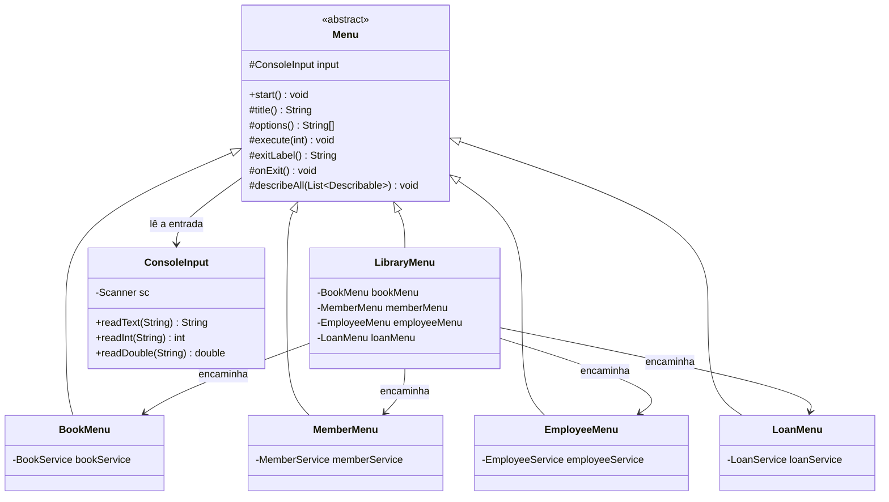
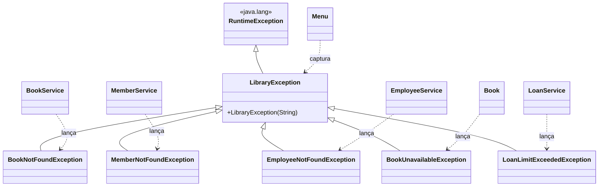
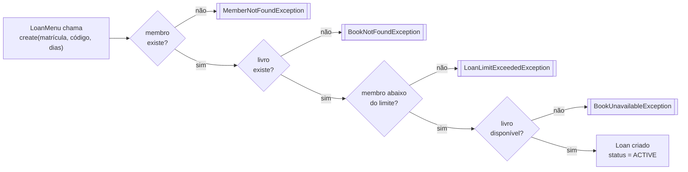

# Sistema de Gerenciamento de Biblioteca — Diagrama de Classes

Projeto da Atividade Prática Avaliativa (01). O sistema gerencia **livros**,
**membros**, **funcionários** e **empréstimos**, aplicando abstração, herança, encapsulamento,
polimorfismo, interfaces e exceções personalizadas.

## 1. Estrutura de pacotes

```
library-management/src/
├── Main.java                            ●  cria a biblioteca e abre o menu
├── app/
│   ├── Menu.java (abstract)             ●  roteiro comum a todo menu; trata as exceções
│   ├── LibraryMenu.java                 ●  menu principal: encaminha para os submenus
│   ├── BookMenu.java                    ●  submenu de livros
│   ├── MemberMenu.java                  ●  submenu de membros
│   ├── EmployeeMenu.java                ●  submenu de funcionários
│   ├── LoanMenu.java                    ●  submenu de empréstimos
│   ├── ConsoleInput.java                ●  leitura e validação da entrada digitada
│   └── SampleData.java                  ●  cenário de exemplo da demonstração
├── interfaces/
│   ├── Describable.java                 ●  contrato: sei me descrever
│   └── Borrowable.java                  ●  contrato: posso ser emprestado
├── entities/
│   ├── book/
│   │   ├── Book.java (abstract)         ●  code, title, author, numberOfPages, available
│   │   ├── PhysicalBook.java            ●  weight
│   │   └── Ebook.java                   ●  fileSize; sempre disponível
│   ├── person/
│   │   ├── Person.java (abstract)       ●  id, name, email
│   │   ├── Member.java                  ●  limite de empréstimos ativos
│   │   └── Employee.java                ●  role, salary
│   └── loan/
│       ├── Loan.java                    ●  associa um livro a um membro
│       └── LoanStatus.java (enum)       ●  ACTIVE, CLOSED
├── services/
│   ├── Library.java                     ●  fachada: reúne os quatro serviços
│   ├── BookService.java                 ●  incluir, editar, remover, listar livros
│   ├── MemberService.java               ●  cadastrar, editar, listar membros
│   ├── EmployeeService.java             ●  cadastrar, editar, listar funcionários
│   └── LoanService.java                 ●  realizar, encerrar, listar empréstimos
└── exceptions/
    ├── LibraryException.java            ●  base de todas as exceções do domínio
    ├── BookNotFoundException.java       ●
    ├── MemberNotFoundException.java     ●
    ├── BookUnavailableException.java    ●
    └── LoanLimitExceededException.java  ●
```

`●` implementado · `◐` esqueleto · `○` a implementar — a árvore inteira está em `●`.
O ponto de entrada é `Main`: cria a `Library`, pede a `SampleData` o cenário da
demonstração — dois livros e um membro — e chama `LibraryMenu.start()`. Os
funcionários começam vazios: são cadastrados pelo menu, como qualquer outro
dado.

**Por que os subpacotes:** `entities` chegaria a nove classes num diretório só.
Agrupar por subdomínio deixa em cada pasta o que muda junto — as três classes de
livro mudam pelo mesmo motivo, e nunca pelo mesmo motivo que as de pessoa.
`LoanStatus` fica ao lado de `Loan` porque só existe para ele: um pacote `enums/`
genérico obrigaria a abrir duas pastas para entender um conceito só.

## 2. Diagrama 1 — Modelo de domínio

Entidades, contratos e as duas hierarquias de herança.



**Pontos de projeto**

- `Book` e `Person` são **abstratas**: não existe "um livro genérico" nem "uma
  pessoa genérica" na prateleira — só livro físico, e-book, membro ou funcionário.
- `Ebook` sobrescreve `isAvailable()` para sempre retornar `true`: cópia digital
  não se esgota. É polimorfismo mudando a **regra**, não apenas o texto impresso.
- `Loan` não herda de ninguém — ele **associa** um `Book` a um `Member`. Herança
  só onde existe relação "é um".

## 3. Diagrama 2 — Camada de serviços

Cada grupo de funcionalidades do enunciado vira um serviço. `Library` é a
fachada que o menu principal enxerga: é dela que cada submenu recebe, no
construtor, apenas o serviço de que precisa.



**Por que separar serviço de entidade:** a entidade guarda e protege o próprio
estado (`Book` sabe se está disponível); o serviço cuida da **coleção** e das
regras que envolvem mais de um objeto (um empréstimo precisa do livro *e* do
membro). Assim `LoanService` é o único ponto que conhece a regra completa.

## 4. Diagrama 3 — Camada de menu

Todo menu do sistema segue o mesmo roteiro: exibir um cabeçalho e as opções,
ler o número escolhido, executar a opção e repetir até o usuário digitar 0.
Esse roteiro fica uma única vez em `Menu.start()`; cada filha declara apenas o
título, os rótulos das opções e o que cada uma faz. É o padrão **Template
Method** — a base define a sequência, as filhas definem os passos.



Em `Menu`, `title()`, `options()` e `execute()` são abstratos — é o que cada
submenu precisa preencher. `exitLabel()` e `onExit()` têm implementação padrão
("Voltar" e não fazer nada), sobrescrita só pelo `LibraryMenu`, que sai do
sistema em vez de voltar.

Dois detalhes do desenho:

- `Menu.start()` **numera as opções** ao imprimi-las, a partir dos rótulos de
  `options()`. Assim o rótulo e o número que `execute()` espera não podem sair
  de sincronia, e as escolhas fora da faixa já são barradas antes de chegar à
  filha.
- Existe um único `ConsoleInput`, criado pelo `LibraryMenu` e repassado aos
  submenus: dois `Scanner` sobre `System.in` disputariam o mesmo buffer e um
  deles perderia linhas.

## 5. Diagrama 4 — Exceções



Todas as exceções do domínio herdam de `LibraryException`. `Menu.start()` faz
**um** `catch (LibraryException e)` e mostra `e.getMessage()` — sem precisar
conhecer cada caso individualmente, e sem que nenhum submenu repita o
tratamento. Isso é polimorfismo aplicado a erros.

Três situações usam `LibraryException` diretamente, por não valerem uma subclasse
própria: código de livro ou matrícula já cadastrados (de membro ou de
funcionário), número de empréstimo inexistente e empréstimo já encerrado. Como herdam do mesmo tipo, caem no mesmo
`catch` da classe `Menu`.

## 6. Fluxo de "realizar empréstimo"

Onde cada exceção nasce:



Encerrar o empréstimo faz o caminho inverso: `loan.close(hoje)` →
`book.giveBack()` → `member.registerReturn()`.

## 7. Conceitos de POO aplicados

| Conceito | Onde está | Por que ali |
|---|---|---|
| **Abstração** | `Book`, `Person` | Definem o que todo livro/pessoa tem, sem poder ser instanciadas. `description()` é abstrato: cada filha decide o que mostrar. |
| **Herança** | `PhysicalBook`/`Ebook` ← `Book`; `Member`/`Employee` ← `Person` | Dois tipos de livro e dois tipos de usuário compartilham atributos e comportamento sem duplicar código. |
| **Herança (na interface)** | `Menu` ← `LibraryMenu`, `BookMenu`, `MemberMenu`, `EmployeeMenu`, `LoanMenu` | O roteiro do menu fica uma vez só na base; cada filha declara apenas título, opções e ações (*Template Method*). |
| **Encapsulamento** | Todos os atributos `private`, acesso por getters/setters | `setNumberOfPages()` bloqueia valor negativo; `available` só muda por `borrow()`/`giveBack()`, nunca direto de fora. |
| **Polimorfismo** | `List<Describable>` chamando `description()`; `Ebook.isAvailable()` | A listagem trata livro, membro e empréstimo do mesmo jeito, sem `if` de tipo. Cada objeto responde do seu jeito. |
| **Interfaces** | `Describable`, `Borrowable` | São *capacidades*, não tipos: `Loan` sabe se descrever mas não é um livro; só `Book` é emprestável. |
| **Exceções** | Hierarquia de `LibraryException` | Situações anormais (livro já emprestado, membro no limite) viram erro tratável com mensagem, em vez de `return null`. |

## 8. Funcionalidades do enunciado → onde ficam

| Funcionalidade | Classe responsável | Método |
|---|---|---|
| Incluir livro | `BookService` | `add(Book)` |
| Editar livro | `BookService` | `update(code, title, author)` |
| Remover livro | `BookService` | `remove(code)` |
| Listar livros | `BookService` | `list()` |
| Cadastrar membro | `MemberService` | `register(Member)` |
| Editar membro | `MemberService` | `update(id, name, email)` |
| Listar membros | `MemberService` | `list()` |
| Cadastrar funcionário | `EmployeeService` | `register(Employee)` |
| Editar funcionário | `EmployeeService` | `update(id, name, email, role, salary)` |
| Listar funcionários | `EmployeeService` | `list()` |
| Realizar empréstimo | `LoanService` | `create(memberId, bookCode, dias)` |
| Encerrar empréstimo | `LoanService` | `close(loanId)` |
| Listar empréstimos | `LoanService` | `list()` / `listByMember(id)` |

## 9. O que vem do projeto `library-system`

Reaproveitado quase sem mudança: `Book`, `PhysicalBook`, `Ebook` (atributos,
validação nos setters e `description()` em português) e a ideia da classe
`Library` como ponto central.

Mudanças ao trazer para cá:

1. `description()` deixa de ser um método abstrato solto e passa a cumprir a
   interface `Describable`.
2. `Book` ganha `code` (identificador para editar e remover) e `available`.
3. `Library` deixa de guardar a lista de livros e passa a ser a fachada dos
   serviços.
